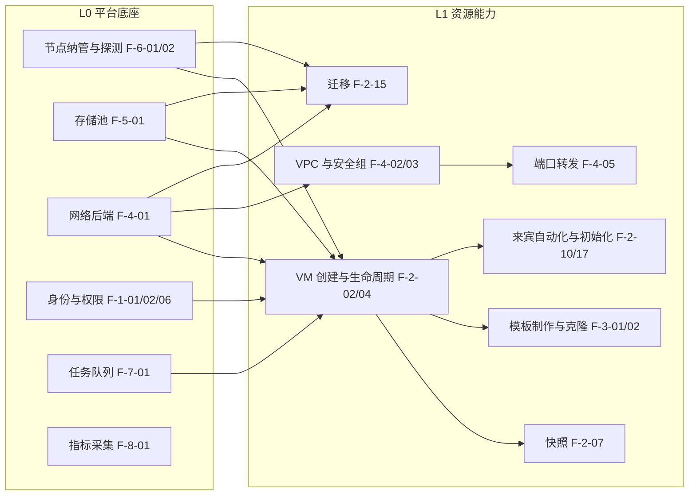

# 能力地图

> 状态：生效
> 最后更新：2026-09-14
> 关联：[`PRD.md`](PRD.md)（功能需求与优先级）· [`ROADMAP.md`](ROADMAP.md)（阶段与里程碑）· [`../08-reference/qvmconsole/capabilities.md`](../08-reference/qvmconsole/capabilities.md)（参考项目能力面）

本文用**一张可导航的全景图**回答三个问题：系统有哪些能力、能力之间什么关系、先有谁后有谁。

**与 PRD 的分工**：`PRD.md` §4 是**逐条需求与优先级**（编号 `F-x-xx`，含说明）；本文是**能力之间的关系视图**（分层、依赖、跨切面、覆盖度、运行态前提），只引用编号、不重复描述。**功能的新增与变更一律改 PRD，本文只跟着调整结构。**

---

## 1. 能力分层

```
┌─ L3 交互与体验层 ────────────────────────────────────────────────┐
│  工作台 · 资源列表与详情 · 控制台 · 平台外壳与设计系统            │
├─ L2 运营与治理层 ───────────────────────────────────────────────┤
│  用户与配额 · 审计 · 安全治理 · 调度与运维 · 诊断 · 对外接口      │
├─ L1 资源能力层 ─────────────────────────────────────────────────┤
│  虚拟机 · 镜像与模板 · 网络治理 · 存储资源                        │
├─ L0 平台底座（先决条件层） ──────────────────────────────────────┤
│  节点与集群 · 存储底座 · 网络底座 · 身份与权限 · 监控采集 · 系统设置 │
└─────────────────────────────────────────────────────────────────┘
     ↑ 跨切面能力（贯穿全部四层，不允许各层各写一套）
       任务与调度 · 实时通道 · 安全与高风险验证 · 配额与计量 · 审计 · 错误与降级
```

**分层规则**：上层能力可以依赖下层，**下层不得依赖上层**；L1 的资源能力必须在 L0 底座可用后才能提供（例如没有可用节点与存储池就创建不了虚拟机）。跨切面能力由 L0/L2 提供通用实现，L1/L3 只做接入。

---

## 2. 能力全景

### L0 平台底座

| 能力簇 | 关键能力 | 编号 |
|---|---|---|
| 节点与集群 | 节点纳管（API + SSH 双通道、保存即探测）、节点状态与探测清单、节点资源清单与直通诊断、迁移目标与接管、维护模式、宿主机虚拟化调优 | F-6-01 ~ F-6-07 |
| 存储底座 | 存储池（识别/格式化挂载/分区/LVM/默认池）、存储卷、容量与配额视图 | F-5-01、F-5-02、F-5-07 |
| 网络底座 | 网络后端抽象（基础/增强）、能力探测与降级、网络状态与自愈 | F-4-01、F-4-13 |
| 身份与权限 | 本地登录、会话与令牌、多阶段登录、RBAC、资源归属 | F-1-01、F-1-02、F-1-03、F-1-06、F-1-09 |
| 监控采集 | 宿主机指标周期采集（含按网卡/硬盘分设备）、历史留存 | F-8-01 |
| 系统设置 | 设置项（含环境变量映射与生效口径）、日志、诊断导出、应急脚本、版本信息 | F-9-01 ~ F-9-03、F-9-05、F-9-06 |

### L1 资源能力层

| 能力簇 | 关键能力 | 编号 |
|---|---|---|
| 虚拟机 | 列表与实时刷新、创建向导、详情、电源与生命周期、编辑配置、磁盘与设备、快照、控制台、来宾自动化、首次启动初始化、重装、救援与锁定、导入、导出、迁移、元数据 | F-2-01 ~ F-2-17 |
| 镜像与模板 | 模板制作、克隆、发布、模板族与版本、模板导入导出 | F-3-01 ~ F-3-05 |
| 网络治理 | VPC 交换机、安全组、ACL、端口转发、公网 IP、静态 IP、端口安全、端口镜像、带宽与流量、防火墙、抓包与诊断、网口与网卡管理 | F-4-02 ~ F-4-12、F-4-14 |
| 存储资源 | 用户存储空间、文件上传、文件管理、目录共享到虚拟机 | F-5-03 ~ F-5-06 |

### L2 运营与治理层

| 能力簇 | 关键能力 | 编号 |
|---|---|---|
| 用户与配额 | 用户管理（状态机与封禁级联）、配额模型与超限处置、运行时长口径 | F-1-07、F-1-08、F-8-06 |
| 安全治理 | 高风险清单与二次验证、输入侧防护、响应安全与错误脱敏、密码策略、公网与开发模式开关、危险变更回滚、进程归属校验、安全中心、审计日志 | F-10-01 ~ F-10-08、F-1-11、F-1-12 |
| 调度与运维 | 调度器框架与调度事件、定时任务、放置策略 | F-7-04、F-7-05、F-6-06 |
| 诊断 | 日志在线查看与脱敏、诊断导出、网络抓包 | F-9-02、F-9-03、F-4-12 |
| 对外接口 | 内置 API 文档、API 凭证 | F-9-04、F-1-10 |
| 账号自助 | 忘记密码、邀请注册、外部身份源 | F-1-05、F-1-13 |

### L3 交互与体验层

| 能力簇 | 关键能力 | 编号 |
|---|---|---|
| 工作台 | 管理员工作台（状态横幅、理论最大量双进度条、KSM/zRAM）、租户工作台（配额总览）、硬件详情 | F-8-03 ~ F-8-05 |
| 资源交互 | 列表/详情/编辑的交互语义（缓存优先、差异提交、配置签名、失焦断开） | F-2-01、F-2-03、F-2-05、F-7-03 |
| 控制台 | VNC 独立窗口与组合键、SPICE 连接文件 | F-2-08、F-2-09 |
| 平台外壳 | 主布局（侧边栏/标签栏/任务栏）、设计系统与主题、全局搜索、国际化 | F-11-01 ~ F-11-04 |

---

## 3. 能力依赖关系

**核心前置链**（箭头表示"必须先有"）：



**关键依赖说明**：

| 能力 | 前置依赖 | 说明 |
|---|---|---|
| VM 创建（F-2-02） | 节点可用（F-6-01/02）+ 存储池（F-5-01）+ 网络后端（F-4-01）+ 配额校验（F-1-08）+ 任务队列（F-7-01） | 任一缺失应给出**可执行的修复提示**，而不是笼统失败 |
| 模板（F-3-01） | 关机态虚拟机 + 存储池 + 任务队列 | 制作中禁止修改元数据 |
| 快照（F-2-07） | 虚拟机 + 存储 + 快照配额 | 运行态自动选择内/外部快照策略 |
| 迁移（F-2-15） | 多节点（F-6-01）+ 目标接管（F-6-04）+ 存储/网络匹配 | 预检不通过即阻断，并给出原因与阈值 |
| 端口转发（F-4-05） | 网络后端（F-4-01）+ 静态 IP（F-4-07）+ 防火墙放通（F-4-11） | 开通时自动绑定静态 IP，避免 DHCP 变化导致转发失效 |
| 配额与超限（F-1-08、F-8-06） | 指标采集（F-8-01/02） | 超时长的判定依赖启动时刻与运行时长累计 |
| 工作台与监控（F-8-03 ~ F-8-05） | 指标采集 + 虚拟机列表投影 | 展示层只读缓存，不在请求路径直连虚拟化层 |
| 放置与调度（F-6-06） | 节点资源清单（F-6-03）+ 存储余量（F-5-07） | 自动放置前先保证人工指定可用 |

---

## 4. 跨切面能力

跨切面能力有**唯一实现**，其他能力只做接入；新增能力时不允许自建平行实现。

| 跨切面 | 承担的能力 | 约束 |
|---|---|---|
| 任务与调度 | F-7-01、F-7-02、F-7-04、F-7-05 | 所有重操作入队；按资源加锁（同一虚拟机互斥、迁移与存储操作串行）；进度与阶段可查；长流程须先定义失败点与回滚范围（F-7-06） |
| 实时通道 | F-7-03 | 列表/详情/任务/指标各自独立通道；心跳、断线重连、失焦断开策略统一实现 |
| 安全与高风险验证 | F-10-01、F-10-02 | 判定口径集中在 F-10-02（不可逆或影响可达性）；前端统一"428 → 验证 → 重试原请求"且单飞加锁 |
| 配额与计量 | F-1-08、F-8-06 | 维度与统计口径统一；超限处置（拒绝 / 转只读 / 自动关机）在各能力入口复用同一判定 |
| 审计 | F-1-12 | 写操作统一记录"谁/何时/对谁/做了什么/结果/前后态"，不只覆盖虚拟机 |
| 错误与降级 | F-10-04 与 PRD §4.3 约定 | 能力探测失败只降级告警、不阻断主流程；错误详情不外泄，日志侧脱敏 |
| 元数据与状态投影 | F-2-16、F-7-03 | 标签/备注/分组以虚拟化层元数据为准，缓存仅作投影；状态以实际运行态为准 |

---

## 5. 能力的运行态前提（依赖分层）

每项能力依赖的宿主侧与来宾侧条件：**缺失时是"整功能不可用"还是"降级"**必须显式定义。

| 能力 | 宿主侧依赖 | 来宾侧依赖 | 缺失时 |
|---|---|---|---|
| 虚拟机创建与电源（F-2-02/04） | libvirt、qemu、磁盘工具、网桥或 OVS | — | 节点探测阶段即拦截，不入库 |
| 快照（F-2-07） | 磁盘格式与快照支持 | — | 降级为外部快照或禁用创建并说明 |
| 迁移（F-2-15） | 目标节点 SSH（用户须为 root）、复制通道 | — | 阻断并给出预检原因与阈值 |
| 来宾自动化（F-2-10） | 虚拟化层通道 | QEMU Guest Agent | 降级为离线路径（关机态处理） |
| 首次启动初始化（F-2-17） | 生成 seed 介质 | cloud-init / cloudbase-init | 明确提示需来宾侧支持，不静默失败 |
| 端口安全 / 端口镜像 / 带宽（F-4-08~10） | OVS 与 OpenFlow13、meter 能力 | — | 能力探测后降级并提示 |
| 防火墙（F-4-11） | 宿主防火墙工具链 | — | 保留只读视图 + 可执行的修复提示 |
| 网络抓包（F-4-12） | 抓包工具与权限 | — | 提示不可用，不影响其余网络功能 |
| 用户存储上传（F-5-04） | 磁盘余量 | — | 拒绝并提示配额/空间不足 |
| 宿主机调优（F-6-07） | 内核模块与可调参数 | — | 只读展示当前值 |
| 硬件直通（F-2-06、F-6-03） | IOMMU 已开启、设备可绑定 | — | 诊断告知前置条件，不强行执行 |

> 这张表是**实现前的检查清单**：每实现一项能力，先确认它的依赖分层写在这里。

---

## 6. 覆盖度对照（完备性）

对照参考项目 [`capabilities.md`](../08-reference/qvmconsole/capabilities.md) 的能力面，逐项确认无缺口。

| 参考项目能力面 | 我们的能力 | 编号 |
|---|---|---|
| §1 信息架构（16 个菜单、角色差异） | 主布局与菜单分组、角色可见性 | F-11-01、F-1-06 |
| §2.1 列表页（实时/分组/标签/批量） | 列表与实时刷新、VM 元数据 | F-2-01、F-2-16 |
| §2.2 创建（四种方式、向导、联动规则） | 创建向导、导入 | F-2-02、F-2-13 |
| §2.3 详情页（Hero 三卡、多标签、IP 解析） | 详情页、静态 IP 与租约 | F-2-03、F-4-07 |
| §2.4 编辑（运行态矩阵、差异提交） | 编辑配置、网口与网卡管理 | F-2-05、F-4-14 |
| §2.5 电源与生命周期 | 电源与生命周期 | F-2-04 |
| §2.6 快照 | 快照 | F-2-07 |
| §2.7 磁盘与设备 | 磁盘与设备、目录共享 | F-2-06、F-5-06 |
| §2.8 控制台（VNC / SPICE） | VNC 控制台、SPICE 控制台 | F-2-08、F-2-09 |
| §2.9 迁移 | 迁移、迁移目标与接管 | F-2-15、F-6-04 |
| §2.10 重装 / 救援 / 锁定 / 导出 | 重装系统、救援与锁定、导出 | F-2-11、F-2-12、F-2-14 |
| §2.11 来宾自动化与密码重置 | 来宾自动化 | F-2-10 |
| §2.12 监控 | 宿主机监控、虚拟机监控 | F-8-01、F-8-02 |
| §3.1 管理员工作台（双进度条、KSM/zRAM、硬件详情） | 管理员工作台、硬件详情 | F-8-03、F-8-05 |
| §3.2 普通用户工作台 | 租户工作台 | F-8-04 |
| §3.3 登录多阶段流程 | 多阶段登录、安全初始化 | F-1-03、F-1-04 |
| §3.4 主布局（侧边栏/标签栏/任务栏/主题） | 主布局 | F-11-01 |
| §3.5 设计系统与前端约定 | 设计系统 | F-11-02 |
| §4 我的存储 | 用户存储空间、文件上传、文件管理 | F-5-03 ~ F-5-05 |
| §4 模板 | 模板制作/克隆/发布/族/导入导出 | F-3-01 ~ F-3-05 |
| §4 系统初始化 | 首次启动初始化、模板预处理 | F-2-17、F-3-01 |
| §4 网络（VPC/安全组/ACL/端口转发/公网 IP/端口安全/镜像/带宽/抓包） | 网络治理各能力 | F-4-02 ~ F-4-12 |
| §4 防火墙 | 防火墙（双层 + 连接管理） | F-4-11 |
| §4 存储（存储池 / 卷 / 安装期选择） | 存储池管理、存储卷 | F-5-01、F-5-02 |
| §4 用户与配额 | 用户管理、配额模型、资源归属 | F-1-07、F-1-08、F-1-09 |
| §4 任务与可观测性 | 任务中心、调度器框架、诊断导出、日志管理 | F-7-02、F-7-04、F-9-02、F-9-03 |
| §4 安全 | 安全治理全部能力、安全中心、应急脚本 | F-10-01 ~ F-10-08、F-1-11、F-9-06 |
| §4 宿主机与节点 | 节点纳管/探测/清单/调优 | F-6-01 ~ F-6-03、F-6-07 |
| §4 系统设置 | 系统设置 | F-9-01 |
| §4 对外 API | 内置 API 文档、API 凭证 | F-9-04、F-1-10 |

**不在对照范围**（已在 PRD §4.0 明确）：已被参考项目移除的功能（端口转发 HTTP 探测与建站扫描、开发者监视器、创建向导智能推荐等）、Kubernetes 管理、分布式存储、计费与商务。

---

## 7. 阶段视角

| 阶段 | 主题 | 覆盖能力 | 完成标志 |
|---|---|---|---|
| M2 最小可用 | 底座打通 + 单机完整生命周期 | L0 全部 + VM 列表/创建/详情/电源/控制台 + 任务与实时通道 + 设置与安全基础（P0） | 能在纳管节点上完成"建 VM → 开机 → 控制台操作 → 关机 → 删除"闭环 |
| M3 功能完善 | 资源能力补齐 | L1 剩余能力 + L2 运营治理主体（P1） | 模板、快照、磁盘、网络治理、用户配额、监控历史、诊断可用 |
| M4 稳定加固 | 治理与体验打磨 | L2/L3 剩余能力（P2）+ 非功能需求 | 高风险清单全覆盖、性能与可观测性达标、多节点与迁移可用 |

> 阶段主题与 [`ROADMAP.md`](ROADMAP.md) 的 M2/M3/M4 划分对应，本表给出各阶段的**能力覆盖口径**；ROADMAP 的里程碑清单与时间待按本表细化。优先级定义见 [`PRD.md`](PRD.md) §4。

---

## 8. 使用约定（人 / AI）

1. **接需求先定位**：在本图 §2 找到能力归属的层与域，再到 PRD §4 取编号与优先级。
2. **先查前置**：动手前核对 §3 的依赖链与 §5 的运行态前提；前置缺失时先做前置，或明确写出降级方案。
3. **跨切面不自建**：任务、实时通道、高风险验证、配额、审计必须复用 §4 的既有实现。
4. **新增能力要回填**：新能力进 PRD §4 → 在本图 §2 登记 → 若属跨切面或新增依赖，同步 §3/§4/§5。
5. **实现前先定"失败与降级"**：参照 §5 给出"整功能不可用 / 降级 / 提示"的明确结论。

---

## 9. 变更记录

| 日期 | 变更内容 |
|---|---|
| 2026-09-14 | 创建文档：确定四层能力模型（L0 底座 / L1 资源 / L2 运营治理 / L3 交互体验 + 跨切面），给出能力全景、依赖链、运行态前提、与参考项目的覆盖度对照与阶段视角 |
