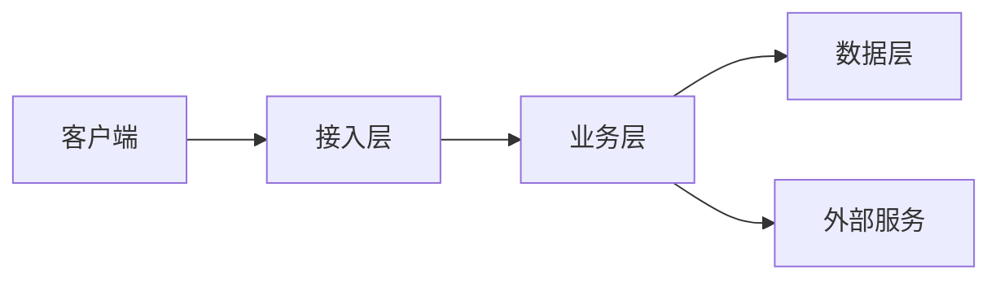

# 架构设计

> 状态：草稿
> 最后更新：<!-- TODO: YYYY-MM-DD -->
> 关联文档：[`TECH_STACK.md`](TECH_STACK.md) · [`DATA_MODEL.md`](DATA_MODEL.md) · [`../03-api/API.md`](../03-api/API.md)

**技术栈尚未确定，本文档为待填充的架构框架。** 正式选型后需补充各节内容，并为重大决策补建 ADR。

---

## 1. 架构目标

<!-- TODO: 描述架构需要优先满足的 3-5 个目标，例如： -->

- **克制设计**：架构复杂度与实际需求匹配。不过度设计、不过度分层，不为假想场景预留扩展点；能用一个模块解决的不拆成三个。**架构的复杂度必须有明确的现实依据。**
- **可维护性**：模块边界清晰，单模块可独立理解与测试。
- **可扩展性**：新增功能以「加模块」而非「改核心」为主。**注意：可扩展性不等于提前抽象**——只在已有明确的需求演进方向时才预留，其余情况等需要时再重构。
- **性能与资源占用**：满足明确的性能目标，且资源占用（CPU、内存、连接、存储）在预算之内。
- **可读性**：结构、命名与依赖关系清晰，新成员可快速理解整体与局部。
- **可观测性**：关键链路有日志、指标、追踪。

### 关键质量属性

| 属性 | 目标 | 验证方式 |
|---|---|---|
| 性能 | <!-- TODO: 如 P95 < 200ms --> | <!-- TODO: 压测 / 基准测试 --> |
| 资源占用 | <!-- TODO: 内存峰值、CPU、连接数上限 --> | <!-- TODO --> |
| 可用性 | <!-- TODO --> | |
| 安全性 | 见 `SECURITY.md` | |
| 可测试性 | 核心逻辑可脱离外部依赖测试 | |
| 复杂度 | 无多余抽象层；模块数与业务边界一致 | 设计评审 |

---

## 2. 整体架构

<!-- TODO: 用文字 + 图（Mermaid / ASCII）描述整体结构 -->



### 分层职责

| 层 | 职责 | 允许依赖 | 禁止事项 |
|---|---|---|---|
| 接入层 | 参数校验、鉴权、协议转换 | 业务层 | 不写业务逻辑 |
| 业务层 | 领域逻辑、事务编排 | 数据层、外部服务 | 不直接处理 HTTP/协议细节 |
| 数据层 | 持久化、查询封装 | 存储 | 不含业务规则 |
| 外部服务层 | 第三方调用封装、重试降级 | — | 不泄漏第三方数据结构到业务层 |

**依赖方向**：上层依赖下层，**禁止反向依赖**；跨层调用必须经过显式接口。

---

## 3. 模块划分

| 模块 | 职责 | 对外接口 | 负责人 |
|---|---|---|---|
| <!-- TODO --> | | | |

### 模块边界规则

- 模块之间只通过**明确定义的接口**通信，禁止直接访问对方内部实现与数据表。
- 模块内部结构对外不可见。
- 新增跨模块依赖需在设计评审中说明理由。

---

## 4. 关键流程

### 4.1 <!-- TODO: 核心流程名 -->

<!-- TODO: 描述触发条件、处理步骤、异常分支、涉及的模块 -->

```
步骤 1 → 步骤 2 → 步骤 3
         ↓ 失败
       补偿/回滚
```

---

## 5. 数据流与存储

- **主存储**：<!-- TODO -->
- **缓存策略**：<!-- TODO: 缓存什么、失效策略、一致性要求 -->
- **数据一致性**：<!-- TODO: 强一致 / 最终一致，跨存储如何保证 -->
- **数据迁移**：见 [`DATA_MODEL.md`](DATA_MODEL.md)

---

## 6. 横切关注点

| 关注点 | 方案 | 说明 |
|---|---|---|
| 配置管理 | <!-- TODO --> | 敏感配置走环境变量 |
| 日志 | <!-- TODO --> | 结构化日志，禁止记录敏感信息 |
| 错误处理 | <!-- TODO --> | 统一错误模型，区分可恢复/不可恢复 |
| 鉴权 | <!-- TODO --> | |
| 限流与熔断 | <!-- TODO --> | |
| 事务边界 | <!-- TODO --> | |

---

## 7. 部署架构

<!-- TODO: 描述部署形态、环境划分、扩容方式 -->

| 环境 | 用途 | 配置来源 |
|---|---|---|
| development | 本地开发 | `.env` |
| staging | 预发布验证 | |
| production | 生产 | |

---

## 8. 已知限制与技术债

| 问题 | 影响 | 计划处理时间 |
|---|---|---|
| | | |

---

## 9. 变更记录

| 日期 | 变更内容 | 变更人 | 关联 ADR |
|---|---|---|---|
| | 初稿 | | |
