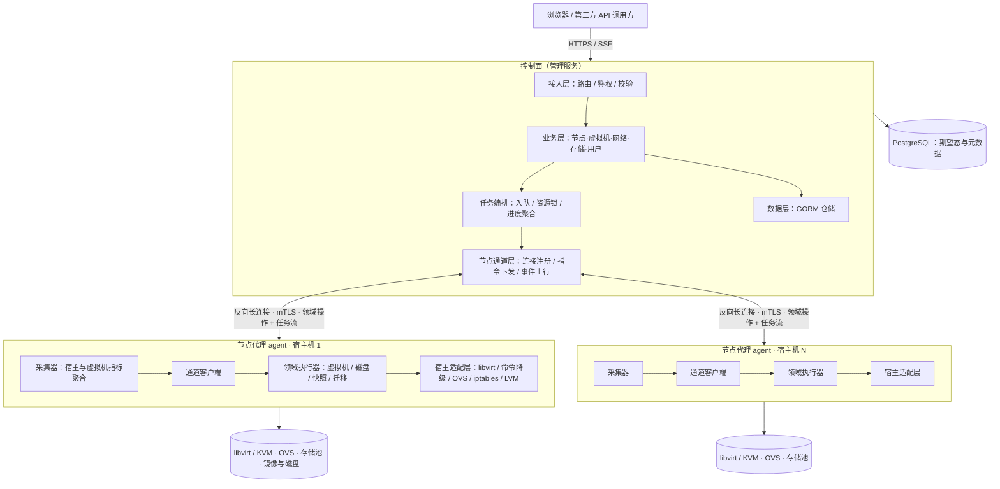

# 架构设计

> 状态：草稿（**控制面 / 节点代理架构已定**，见 [ADR-0005](../06-decisions/0005-control-plane-node-agent-architecture.md)；性能与容量指标待压测补充）
> 最后更新：2026-09-15
> 关联文档：[`TECH_STACK.md`](TECH_STACK.md) · [`DATA_MODEL.md`](DATA_MODEL.md) · [`FRONTEND.md`](FRONTEND.md) · [`../03-api/API.md`](../03-api/API.md) · [`../06-decisions/0005-control-plane-node-agent-architecture.md`](../06-decisions/0005-control-plane-node-agent-architecture.md)

---

## 1. 架构目标

- **克制设计**：架构复杂度与实际需求匹配。不过度设计、不过度分层，不为假想场景预留扩展点；能用一个模块解决的不拆成三个。**架构的复杂度必须有明确的现实依据。**
- **平台解耦**：控制面保持平台无关；一切与虚拟化、发行版、系统命令相关的实现都在节点代理（agent）内。
- **安全边界清晰**：用户面用 JWT / API Key；控制面与节点面用 mTLS；**控制面不持有宿主机登录凭据**。
- **大数据不出宿主机**：磁盘、镜像、指标原始采样在节点侧处理，回传控制面的只有**聚合结果与进度**。
- **可维护性**：模块边界清晰，单模块可独立理解与测试。
- **可扩展性**：新增功能以「加模块」而非「改核心」为主。**注意：可扩展性不等于提前抽象**。
- **性能与资源占用**：满足明确的性能目标，且资源占用在预算之内。
- **可读性**：结构、命名与依赖关系清晰，新成员可快速理解整体与局部。
- **可观测性**：关键链路有日志、任务阶段与状态事件。

### 关键质量属性

| 属性 | 目标 | 验证方式 |
|---|---|---|
| 性能 | 控制面只读接口 P95 < 200ms（不含任务执行）；列表接口**不直连节点** | 压测 + 接口埋点 |
| 规模 | 单控制面 ≥ 50 节点、≥ 2000 虚拟机（首批目标，见 §8） | 压测 |
| 资源占用 | 控制面常驻内存 < 300MB；agent 常驻 < 80MB、空闲 CPU < 1% | 实测 |
| 可用性 | 控制面故障不影响已运行虚拟机；单节点离线不影响其他节点 | 故障演练 |
| 安全性 | 节点接入用一次性令牌 + mTLS；控制面无宿主机登录凭据 | 安全自查（`SECURITY.md`） |
| 可测试性 | agent 的领域接口可脱离真实 libvirt 测试（接口打桩）；控制面可脱离节点测试 | 单元测试 |
| 复杂度 | 控制面与 agent 两块，各自可独立理解与部署；无多余抽象层 | 设计评审 |

---

## 2. 整体架构



### 期望态与运行态

| 状态 | 持有方 | 说明 |
|---|---|---|
| **期望态** | 控制面（PostgreSQL） | 配置、配额、资源归属、任务意图 |
| **运行态** | 节点代理 | 虚拟机真实状态、宿主与虚拟机指标、宿主机网络与存储现状 |
| 两者关系 | — | 控制面**不假设**运行态等于期望态；通过周期对账与 agent 上报收敛，**冲突时以运行态为准**并把差异暴露给用户 |

### 分层职责

**控制面**

| 层 | 职责 | 允许依赖 | 禁止事项 |
|---|---|---|---|
| 接入层 | 参数校验、鉴权、协议转换 | 业务层 | 不写业务逻辑 |
| 业务层 | 领域逻辑、事务编排、权限与配额判定 | 数据层、任务层、节点通道层 | **不直接接触 libvirt 与宿主机命令** |
| 任务编排层 | 入队、并发与资源锁、阶段进度、重试与取消 | 数据层、节点通道层 | 不实现领域逻辑 |
| 节点通道层 | agent 连接注册、能力缓存、指令下发、事件上行 | 业务层、任务层 | 不做业务判断 |
| 数据层 | 持久化与查询封装 | PostgreSQL | 不含业务规则 |

**节点代理（agent）**

| 层 | 职责 | 禁止事项 |
|---|---|---|
| 通道客户端 | 注册、心跳、指令收发、进度上报、断线重连 | 不解析业务语义 |
| 领域执行器 | 虚拟机与磁盘的领域动作（创建 / 电源 / 磁盘 / 快照 / 迁移 / 重装 …），保证**幂等** | 不做权限与配额判定（由控制面负责） |
| 宿主适配层 | libvirt API 优先、命令降级；OVS / iptables / LVM / 抓包等宿主操作 | **不把宿主机差异抛给控制面** |
| 采集器 | 指标采样与**本地聚合 / 降采样**、能力探测 | 不回传原始采样全量数据 |

**依赖方向**：两侧各自自上而下，**禁止反向依赖**；控制面与 agent 之间**只通过领域接口通信**，不共享内部结构、不转发 libvirt 原始 RPC（见 ADR-0005 §3）。

---

## 3. 模块划分

**控制面模块**

| 模块 | 职责 | 关联能力 |
|---|---|---|
| 身份与权限 | 账号、会话、RBAC、配额、资源归属 | F-1-* |
| 节点管理 | 节点注册与撤销、能力缓存、心跳状态、维护模式 | F-6-* |
| 虚拟机 | 生命周期、配置、快照、磁盘、控制台、迁移、来宾自动化 | F-2-* |
| 镜像与模板 | 制作 / 克隆 / 发布 / 导入导出 | F-3-* |
| 网络 | 交换机、安全组、ACL、端口转发、公网 IP、防火墙、端口安全与镜像 | F-4-* |
| 存储 | 存储池、卷、用户存储、上传会话、共享挂载 | F-5-* |
| 任务与调度 | 任务队列、定时任务、调度器、事件 | F-7-* |
| 监控 | 指标接收与落库、工作台聚合 | F-8-* |
| 设置与运维 | 设置、日志、诊断导出 | F-9-* |
| 安全与审计 | 高风险验证、输入防护、审计日志 | F-10-*、F-1-12 |

**agent 模块**

| 模块 | 职责 |
|---|---|
| 通道 | 注册、mTLS 长连接、心跳、指令分发、断线重连与对账 |
| 执行器 | 虚拟机 / 磁盘 / 快照 / 镜像 / 迁移 / 网络 / 存储 / 抓包 的领域动作，幂等与阶段进度上报 |
| 宿主适配 | libvirt 客户端（优先）与命令降级；系统差异集中于此 |
| 采集 | 宿主与虚拟机指标采样、本地聚合、能力探测 |

### 模块边界规则

- 模块之间只通过**明确定义的接口**通信，禁止直接访问对方内部实现与数据表。
- 模块内部结构对外不可见。
- 新增跨模块依赖需在设计评审中说明理由。

---

## 4. 关键流程

### 4.1 节点纳管

```
控制面生成一次性注册令牌（可设有效期）
  → 运维在物理机执行安装命令（内嵌控制面地址与令牌）
  → agent 用令牌注册 → 换取客户端证书（mTLS）
  → agent 自探测能力并上报 → 建立长连接
  → 控制面标记节点在线、缓存能力 → 界面可见
```

失败分支：令牌过期或已用 → agent 退出并提示重新生成；证书校验失败 → 拒绝连接并记审计。

### 4.2 创建虚拟机

```
前端提交 → 控制面校验（权限 / 配额 / 参数 / 节点在线且具备能力）
  → 写入期望态 + 任务入队（携带幂等键）
  → 节点通道下发指令 → agent 执行（建盘 → 定义 XML → 启动 → 网络绑定）
  → agent 按阶段上报进度 → 控制面聚合并推送前端
  → 完成后 agent 上报运行态 → 控制面落库并广播
```

失败处理：任一阶段失败 → 任务标记失败并附阶段原因；**回滚范围由任务定义**（如已建盘则清理）；取消按同一回滚路径处理，并在界面说明"已完成的步骤可能不会回滚"。

### 4.3 指标采集

```
agent 侧采样（/proc、libvirt RPC、iostat…）
  → 本地聚合与降采样 → 周期上报增量与快照
  → 控制面落库（历史）+ 内存投影（实时）
  → 实时值经 SSE 推送前端；历史按时间范围查询
```

原则：控制面**不直连节点**取指标；节点离线时其指标停止更新并标记**陈旧**。

### 4.4 断连与对账

```
心跳超时 → 控制面标记节点离线（数据保留并打「陈旧时间戳」）
        → 该节点资源的新任务拒绝下发；进行中任务标记为“状态未知”
agent 重连 → 上报能力与运行态快照
        → 控制面按运行态修正投影、收敛“状态未知”的任务并给出结论
```

原则：**控制面故障不影响已运行虚拟机**；节点故障不影响其他节点（见 `AGENTS.md` 第 5 节"单步失败只降级告警、不阻断主流程"）。

### 4.5 跨节点迁移

```
控制面预检（源 / 目标 agent 在线、能力、存储余量、网络匹配、脏页速率评估）
  → 编排：目标 agent 预建资源 → 数据传输（agent↔agent 或经控制面中转，见 §8）
  → 完成后目标 agent 接管（固件变量、网络绑定、凭据）
  → 源侧清理并回收资源
```

---

## 5. 数据流与存储

- **主存储**：PostgreSQL，控制面唯一持久化；表结构与迁移见 [`DATA_MODEL.md`](DATA_MODEL.md)。
- **节点本地存储**：镜像、模板、虚拟机磁盘与快照由 agent 在宿主机上管理，**控制面只保存路径与元数据**。
- **缓存**：控制面内存保存"实时投影"（列表、指标最新值、节点能力），进程重启后由数据库 + agent 上报重建；**当前不引入分布式缓存**（见 §8）。
- **数据一致性**：控制面与节点之间是**最终一致**——控制面保存期望态与最近一次上报的运行态，不一致时按对账周期收敛，并**向用户暴露差异**而非静默修正。
- **数据迁移**：见 [`DATA_MODEL.md`](DATA_MODEL.md) §6（显式迁移，只增不改）。

---

## 6. 横切关注点

| 关注点 | 方案 | 说明 |
|---|---|---|
| 配置管理 | 控制面：环境变量；agent：配置文件 + 启动参数（含注册令牌） | 敏感项不以明文入库 |
| 日志 | 结构化日志；控制面集中 + agent 本地轮转 | 禁止记录敏感信息（`AGENTS.md` 第 7 节） |
| 错误处理 | 统一错误模型（稳定错误码 + 可读文案）；任务级失败带阶段与可重试标记 | 区分"用户可修正"与"系统故障" |
| 鉴权（用户面） | JWT 会话 + API Key + 高风险二次验证 | F-1-*、F-10-01 |
| 鉴权（节点面） | 一次性注册令牌 → mTLS 客户端证书，连接与节点绑定 | ADR-0005 §5 |
| 能力探测 | **agent 自报**，控制面缓存并据此降级 | ADR-0005 §6 |
| 幂等与重试 | 任务带幂等键；agent 动作幂等；重连后对账 | 两侧都可能重启 |
| 限流与隔离 | 接入层按来源限流；节点通道按连接隔离 | 防止单节点故障扩散 |
| 事务边界 | DB 事务只覆盖元数据，**不含跨节点动作** | 跨节点用任务 + 回滚补偿，不用分布式事务 |

---

## 7. 部署架构

| 组件 | 形态 | 部署位置 | 说明 |
|---|---|---|---|
| 控制面 | 单二进制 + 前端静态资源 | 运维环境（可容器化） | 起步单实例；多实例需外部化会话与限流（§8） |
| 节点代理 | 单二进制（系统服务，systemd 托管） | 每台被管宿主机 | 与控制面同仓库构建、独立发布 |
| 数据库 | PostgreSQL 14+ | 独立实例 | 生产不使用 SQLite |

| 环境 | 用途 | 配置来源 |
|---|---|---|
| development | 本地开发（默认 SQLite；可选本地 agent） | `.env` |
| staging | 预发布验证 | 环境变量注入 |
| production | 生产 | 环境变量注入 |

**网络要求**：默认只需 **agent → 控制面的出向连通**；如启用直连模式，再开放 agent 的入站端口。

---

## 8. 已知限制与技术债

| 问题 | 影响 | 计划处理时间 |
|---|---|---|
| 控制面单实例部署 | 无法水平扩展，存在单点 | 多实例需先外部化会话 / 限流 / 任务队列（待 PRD Q-4 定规模） |
| 无分布式缓存 | 实时投影仅存于单进程内存 | 多实例时引入 |
| 指标保留期有限 | 无法做长周期趋势分析 | 需要时引入时序库（见 [`DATA_MODEL.md`](DATA_MODEL.md) §7） |
| agent 不支持自动升级 | 规模化升级需人工 | 节点数量上规模前实现 |
| 跨节点迁移的数据通道未定（agent↔agent vs 控制面中转） | 影响带宽占用与实现复杂度 | 实现迁移能力（F-2-15）前定 |

---

## 9. 变更记录

| 日期 | 变更内容 | 变更人 | 关联 ADR |
|---|---|---|---|
| 2026-09-15 | 按**控制面 / 节点代理**架构填充：整体架构与期望态/运行态划分、控制面与 agent 的分层职责与禁止事项、模块划分、5 个关键流程（纳管 / 创建 / 采集 / 断连对账 / 跨节点迁移）、横切关注点、部署架构与已知技术债 | AI | [0005](../06-decisions/0005-control-plane-node-agent-architecture.md) |
| 2026-09-15 | §8 已知限制移除「前端技术栈未定」（已由 [ADR-0006](../06-decisions/0006-frontend-tech-stack.md) 定稿） | AI | [0006](../06-decisions/0006-frontend-tech-stack.md) |
