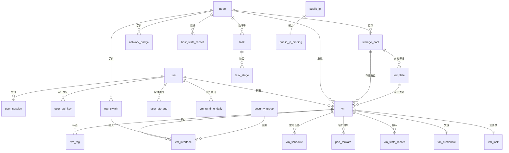

# 数据模型

> 状态：生效（表结构已建到 PostgreSQL；字段级以 §4 与 [`internal/database/migrations/`](../../internal/database/migrations/0001_init_schema.sql) 为准）
> 最后更新：2026-09-14
> 关联文档：[`ARCHITECTURE.md`](ARCHITECTURE.md) · [`TECH_STACK.md`](TECH_STACK.md) · [`../01-product/PRD.md`](../01-product/PRD.md)（功能编号 `F-x-xx`）· [`../01-product/CAPABILITY_MAP.md`](../01-product/CAPABILITY_MAP.md)（能力分层与依赖）

本文描述 **k_cockpit 的逻辑数据模型**：有哪些表、表之间什么关系、关键字段与索引、迁移与保留策略。**具体建表语句以迁移实现为准**；表结构变更一律走 §6 的迁移规则。

---

## 0. 设计要点（与参考项目的差异）

| 维度 | 参考项目（QVMConsole） | 我们的做法 | 理由 |
|---|---|---|---|
| 表名 | 复数（`users`、`vpc_switches`） | **单数**（`user`、`vpc_switch`） | 项目已定 GORM `SingularTable`，避免 `user` / `users` 两套命名并存（见 `internal/database`） |
| 部署形态 | 单机：面板与被管宿主机 1:1 | **多节点**：资源表带 `node_id`，"全局名称唯一"改为"**`(node_id, name)` 唯一**" | 一个控制面管理 N 台宿主机（PRD §4.2）；这也是迁移与放置能力的前提 |
| 节点接入 | 目标面板 API + 宿主机 **root SSH** 双通道（控制面持有各节点凭据） | **agent 反向长连接** + 一次性注册令牌 + mTLS；`node` 表**不含任何登录凭据字段** | [ADR-0005](../06-decisions/0005-control-plane-node-agent-architecture.md)：凭据集中化风险不可接受，能力探测下沉到节点 |
| 异步任务 | 纯内存，进程重启即丢失 | **落库**：`task` + `task_stage`；任务带**幂等键**、下发时间与最近上报时间 | 控制面重启不丢任务；任务中心可查历史；agent 侧据幂等键去重、重连重放不重复执行；支持"宿主阶段/来宾阶段"分别重试与审计 |
| JSON 列 | SQLite `text` 内嵌 JSON | 统一 `text` + 应用层序列化，**不使用 PG 的 `JSONB`** | 双库（PostgreSQL / SQLite）行为一致，避免驱动差异 |
| 运行时属性 | 面板配置落库，运行时走命令 | 同：**快照、磁盘、网卡运行时详情以虚拟化层为唯一事实来源，不落库** | 避免双源不一致；配额计数按需查询 |
| 外键 | 无数据库级外键 | 同：**不建数据库外键**，用索引 + 应用层校验 + 显式级联删除 | 与 GORM 约定一致；软删除与级联策略必须在应用层决策，硬外键会挡住 |
| 控制面自身宿主 | 面板必须运行在被管宿主机上 | 控制面**默认不纳管自身宿主**；需要时把自身当作一个普通 `node` 纳管 | 解耦面板与宿主机，便于迁移与横向扩展 |
| 云类型 / 配额 | `cloud_type`（弹性云 / 轻量云）+ 单 VM 配额表 | **未定**（PRD Q-3）：配额先以 `user` 上的配额列表达；若确认"角色 + 配额档位"再引入 `quota_profile` | 不提前抽象（不过度设计） |
| 端口转发协议 | 单行支持 `tcp/udp/两者` | `protocol` 只允许 `tcp` / `udp`，**"两者"落两行** | 让 `(node_id, protocol, host_port)` 唯一索引直接生效，避免"两者"与单协议冲突判定 |
| 会话与限流 | 会话落库；登录限流在内存 | 同：会话落库（可撤销、可审计）；**登录限流在内存**（多实例时需外部存储，见 §9） | 先不过早引入 Redis |

---

## 1. 建模原则

1. **单一职责**：一张表只表达一个概念；投影类表（如 `vm`）与业务实体表在注释中明确区分。
2. **主键**：统一 `id bigint` 自增，**不使用业务字段作主键**；业务唯一性用唯一索引表达（如 `uniq_vm_node_name`）。
3. **审计字段**：所有表含 `created_at` / `updated_at`（UTC）；需要追责的表再含 `created_by`。
4. **删除策略**（显式声明，见 §2 各表标注）：
   - **软删除**（`deleted_at`）：业务实体（`user`、`node`、`template`、`vpc_switch`、`security_group`、`storage_pool`）——删除影响历史与审计。
   - **物理删除**：投影表（`vm`、`vm_stats_record`、`host_stats_record`）、会话与令牌、统计聚合表。
5. **时间**：统一存 UTC，仅在前端展示时转换时区。
6. **枚举**：一律用**字符串**而非魔法数字，取值登记在 §5。
7. **布尔**：使用真正的布尔类型，不用 0/1。
8. **空值**：字段尽量 `NOT NULL` + 默认值，减少空值分支；确实"未设置"的语义才允许 NULL。
9. **敏感字段**：凭据、密钥、2FA 密钥一律**加密后落库**，列名以 `_enc` 结尾；**哈希类字段**（令牌、验证码）只存哈希，以 `_hash` 结尾。
10. **多节点归属**：凡属于某台宿主机的资源，必须有 `node_id` 且建索引；不允许出现"只能有一台宿主机"的隐式假设。

---

## 2. 实体清单

共 **43 张表**，按域列出。"删除"列标注软删除（软）或物理删除（物）。

### 2.1 身份与安全（7）

| 表 | 用途 | 关键字段与索引 | 删除 | 关联功能 |
|---|---|---|---|---|
| `user` | 账号、角色、状态、配额、安全状态 | `uniq_user_username`；`idx_user_role_status`、`idx_user_email` | 软 | F-1-01 ~ F-1-11 |
| `user_session` | 服务端会话（可撤销、可审计） | `uniq_user_session_session_id`；`idx_user_session_user_id`、`idx_user_session_expires_at` | 物 | F-1-02 |
| `user_api_key` | API 凭证 | `uniq_user_api_key_user_id`；`idx_user_api_key_prefix` | 物 | F-1-10 |
| `auth_action_token` | 邮件链接类令牌（邀请、找回密码、邮箱绑定） | `uniq_auth_action_token_token_hash`；`idx_auth_action_token_user_purpose` | 物 | F-1-04、F-1-05 |
| `security_challenge` | 邮箱验证码与高风险二次验证挑战 | `idx_security_challenge_user_purpose`、`idx_security_challenge_expires_at` | 物 | F-1-03、F-1-04、F-10-01 |
| `audit_log` | 审计日志（谁 / 何时 / 对哪个资源 / 做了什么 / 结果） | `idx_audit_log_created_at`、`idx_audit_log_resource`、`idx_audit_log_operator_id` | 物 | F-1-12 |
| `system_setting` | 键值持久化设置（覆盖环境变量默认值）；含 `value`、`previous_value`（最近一次变更前值，供回滚）、`updated_by`、`updated_at` | 主键 `key` | 物 | F-9-01 |

### 2.2 节点（1）

| 表 | 用途 | 关键字段与索引 | 删除 | 关联功能 |
|---|---|---|---|---|
| `node` | 被管宿主机：**agent 注册与信任信息**（注册令牌哈希、证书指纹、注册状态）、agent 与协议版本、心跳与状态、**能力自报**、维护模式 | `uniq_node_name`、`uniq_node_agent_id`；`idx_node_enabled_status`、`idx_node_last_heartbeat` | 软 | F-6-01 ~ F-6-08 |

### 2.3 存储（6）

| 表 | 用途 | 关键字段与索引 | 删除 | 关联功能 |
|---|---|---|---|---|
| `storage_pool` | 存储池（本地盘 / LVM 卷组），含"设为默认" | `uniq_storage_pool_node_device`；`idx_storage_pool_node_id` | 软 | F-5-01、F-5-07 |
| `storage_volume` | LVM 存储卷（多盘聚合、条带 / 镜像） | `uniq_storage_volume_node_name` | 物 | F-5-02 |
| `user_storage` | 租户存储空间（开通状态与配额） | `uniq_user_storage_user_node` | 物 | F-5-03、F-5-07 |
| `storage_file` | **上传登记与文件索引**：sha256（秒传）、ISO 元数据（系统类型 / 版本 / 最小磁盘） | `uniq_storage_file_rel_path`；`idx_storage_file_sha256` | 物 | F-5-04、F-5-05 |
| `upload_session` | 分片上传会话（断点续传、缺失分片补传） | 主键 `upload_id`；`uniq_upload_session_file_key`；`idx_upload_session_expires_at` | 物 | F-5-04、F-3-05 |
| `share_mount` | 宿主机目录以 9p VirtFS 共享给虚拟机 | `uniq_share_mount_vm_tag` | 物 | F-5-06 |

### 2.4 网络（16）

| 表 | 用途 | 关键字段与索引 | 删除 | 关联功能 |
|---|---|---|---|---|
| `network_bridge` | 宿主机网桥 / 系统网络（基础模式网桥、系统 OVS 网桥） | `uniq_network_bridge_node_name`；`idx_network_bridge_node_system` | 物 | F-4-01、F-4-13 |
| `vpc_switch` | VPC 交换机（空交换机 / 物理直通 / 内置 DHCP-NAT）、VLAN 与配额 | `uniq_vpc_switch_node_name`；`uniq_vpc_switch_node_vlan` | 软 | F-4-02 |
| `security_group` | 安全组（支持默认组） | `uniq_security_group_node_name`；`idx_security_group_owner_id` | 软 | F-4-03 |
| `security_group_rule` | 安全组规则（方向、协议、端口、目标类型） | `idx_security_group_rule_group_id` | 物 | F-4-03 |
| `vm_interface` | 虚拟机网口绑定（交换机 + 安全组 + 型号 + 速率 + 允许地址） | `uniq_vm_interface_vm_order`；`idx_vm_interface_switch_id` | 物 | F-4-14、F-2-05 |
| `static_ip` | 静态 IP / DHCP 保留绑定 | `uniq_static_ip_node_ip`；`idx_static_ip_vm_id` | 物 | F-4-07 |
| `port_forward` | 端口转发（自动静态 IP 绑定、入站白名单、区域限制） | `uniq_port_forward_node_proto_port`；`idx_port_forward_vm_id` | 物 | F-4-05 |
| `public_ip` | 公网 IP 资源池（模式、地址族、出口网卡） | `uniq_public_ip_node_ip`；`idx_public_ip_node_status` | 物 | F-4-06 |
| `public_ip_binding` | 公网 IP 绑定（模式与运行态） | `uniq_public_ip_binding_public_ip_id`；`idx_public_ip_binding_vm_id` | 物 | F-4-06 |
| `port_mirror` | 端口镜像（多来源 → 多目标，方向、回滚看门狗时间） | `idx_port_mirror_node_id` | 物 | F-4-09 |
| `port_security_policy` | 端口安全策略与协调状态（反欺骗 / 隔离 / 包速率） | `uniq_port_security_policy_node_port` | 物 | F-4-08 |
| `firewall_policy` | KVM 网络防火墙全局策略（默认动作、区域、开关） | `uniq_firewall_policy_node_id` | 物 | F-4-11 |
| `firewall_vm_policy` | 虚拟机级防火墙覆盖与白名单 | `uniq_firewall_vm_policy_vm_id` | 物 | F-4-11 |
| `firewall_rule` | 宿主机防火墙规则（系统保护规则标记为不可编辑） | `uniq_firewall_rule_dedup`；`idx_firewall_rule_node_protected` | 物 | F-4-11 |
| `network_capture` | 抓包记录（接口、过滤条件、文件与所属任务） | `idx_network_capture_node_id`、`idx_network_capture_task_id` | 物 | F-4-12 |
| `traffic_stat_daily` | 流量日统计（按用户 / 交换机 / 虚拟机三个口径统一） | `uniq_traffic_stat_scope_date`；`idx_traffic_stat_owner_date` | 物 | F-1-08、F-4-10 |

### 2.5 虚拟机（7）

| 表 | 用途 | 关键字段与索引 | 删除 | 关联功能 |
|---|---|---|---|---|
| `vm` | **投影 + 元数据**：归属、备注、分组；状态与规格为投影字段 | `uniq_vm_node_name`、`uniq_vm_node_uuid`；`idx_vm_owner_id`、`idx_vm_status` | 物 | F-2-01、F-2-16、F-1-09 |
| `vm_tag` | 虚拟机标签 | `uniq_vm_tag_vm_tag`；`idx_vm_tag_tag` | 物 | F-2-16 |
| `vm_credential` | 虚拟机登录凭据（加密存储） | `uniq_vm_credential_vm_id` | 物 | F-2-10 |
| `vm_lock` | 业务软锁（禁删除 / 禁磁盘迁移） | `uniq_vm_lock_vm_id` | 物 | F-2-12 |
| `vm_schedule` | 虚拟机定时任务（一次性 / 每天 / 每周） | `idx_vm_schedule_next_run`、`idx_vm_schedule_vm_id` | 物 | F-7-05 |
| `vm_stats_record` | 虚拟机指标历史（CPU / 内存 / 磁盘 IO / 网络） | `idx_vm_stats_vm_at`、`idx_vm_stats_node_at` | 物 | F-8-02 |
| `vm_runtime_daily` | 运行时长日统计（月度时长配额与超限关机的口径） | `uniq_vm_runtime_vm_date`；`idx_vm_runtime_owner_date` | 物 | F-1-08、F-8-06 |

### 2.6 模板（1）

| 表 | 用途 | 关键字段与索引 | 删除 | 关联功能 |
|---|---|---|---|---|
| `template` | 模板与版本族（父子关系）、发布设置、默认创建配置、不可变标记 | `uniq_template_node_name`；`idx_template_parent_id`、`idx_template_node_published` | 软 | F-3-01 ~ F-3-05 |

### 2.7 任务与调度（3）

| 表 | 用途 | 关键字段与索引 | 删除 | 关联功能 |
|---|---|---|---|---|
| `task` | 异步任务：类型、**幂等键**、状态、参数（脱敏）、进度、结果、取消标记、下发与上报时间 | `uniq_task_idempotency_key`；`idx_task_status_created`、`idx_task_node_id`、`idx_task_resource`、`idx_task_type`、`idx_task_dispatched_at` | 物 | F-7-01、F-7-02、F-7-06 |
| `task_stage` | 任务阶段（宿主阶段 / 来宾阶段），支持阶段级重试 | `idx_task_stage_task_seq` | 物 | F-2-10、F-7-06 |
| `scheduler_event` | 调度事件（调度器 key / 分组 / 结果） | `idx_scheduler_event_key`、`idx_scheduler_event_created_at` | 物 | F-7-04 |

### 2.8 监控（1）

| 表 | 用途 | 关键字段与索引 | 删除 | 关联功能 |
|---|---|---|---|---|
| `host_stats_record` | 宿主机指标历史；设备级数据以 JSON 内嵌（不单独建表） | `idx_host_stats_node_at` | 物 | F-8-01 |

### 2.9 迁移（1）

| 表 | 用途 | 关键字段与索引 | 删除 | 关联功能 |
|---|---|---|---|---|
| `schema_migration` | 迁移登记：已执行的迁移 ID、校验和与时间（保证"只增不改"） | 主键 `migration_id` | 物 | §6 |

### 2.10 不落库的能力（为什么没有对应的表）

设计时刻意**不为下列能力建表**，避免双源不一致与冗余表：

| 能力 | 持久化方式 | 原因 |
|---|---|---|
| 电源与生命周期（F-2-04）、编辑下发（F-2-05）、磁盘与设备（F-2-06）、快照（F-2-07）、控制台（F-2-08/09）、迁移（F-2-15） | **以虚拟化层为唯一事实来源**；过程只在 `task` / `task_stage` / `audit_log` 留痕 | 面板重启后仍以真实运行态为准；快照与磁盘不落库可避免与虚拟化层漂移 |
| 首次启动初始化（F-2-17）、来宾自动化（F-2-10） | 参数随 `task` 记录，执行结果落 `task_stage` | 一次性动作，无常驻状态 |
| ACL 预览（F-4-04） | 由安全组规则**实时汇总计算** | 无独立状态 |
| 实时通道（F-7-03）与指标实时值（F-8-02 ~ F-8-05） | 周期采集落 `host_stats_record` / `vm_stats_record`；实时值只在内存 | 展示层只读缓存，不在请求路径直连虚拟化层 |
| 导入 / 导出（F-2-13、F-2-14、F-3-05） | 结果文件 + `task` / `storage_file` | 无常驻状态 |
| 节点能力明细（F-6-02） | agent 自报，内嵌 `node.capabilities`（JSON）+ `capabilities_at` | 只需保留最近一次上报结果与时间，不保留历史序列 |
| 高风险验证挑战（F-10-01） | `security_challenge` | 短时有效，用后即焚 |
| 输入侧防护与响应安全（F-10-03、F-10-04）、公网开关（F-10-06）、危险变更回滚（F-10-07） | 中间件与内存状态；开关类配置落 `system_setting` | 无业务实体 |
| 进程与资源归属校验（F-10-08） | 运行时判定 | 规则属代码约束，不落数据 |
| 密码泄露检测（F-10-05） | `user.breach_checked_at` / `user.breach_hit` | 只需当前结论与时间 |
| 界面偏好（F-11-01/02）、全局搜索（F-11-03）、国际化（F-11-04） | 前端本地存储 / 实时查询 | 与后端持久化数据无关 |
| 日志（F-9-02）、诊断导出（F-9-03）、内置 API 文档（F-9-04）、版本信息（F-9-05）、应急脚本（F-9-06） | 文件与任务；API 文档由路由定义生成 | 不需要额外表 |
| 运行时长实时累计 | 按周期聚合进 `vm_runtime_daily` | 原始样本不长期保留 |

---

## 3. 实体关系

只画主干关系（字段见 §4；未列出的表通过 `node_id` / `user_id` 等外键列关联）。

---

## 4. 核心实体字段定义

> 覆盖主干链路（账号 → 节点 → 存储 → 网络 → 虚拟机 → 任务 → 审计）。其余表的关键字段见 §2。
> **字段级的权威来源是迁移脚本** `internal/database/migrations/0001_init_schema.sql`：两者不一致时以脚本为准，并回头修正本节。

### 4.1 `user`

| 字段 | 类型 | 可空 | 默认值 | 说明 |
|---|---|---|---|---|
| id | bigint | 否 | 自增 | 主键 |
| username | varchar(64) | 否 | — | 登录名，唯一 |
| password_hash | varchar(255) | 否 | — | 强哈希（bcrypt / argon2id） |
| role | varchar(16) | 否 | `tenant` | `admin` / `tenant` |
| status | varchar(16) | 否 | `pending` | `pending` / `active` / `banned` |
| email | varchar(128) | 是 | NULL | 绑定邮箱 |
| email_verified_at | timestamptz | 是 | NULL | 邮箱验证时间 |
| totp_secret_enc | text | 是 | NULL | 2FA 密钥（加密） |
| totp_enabled | bool | 否 | false | 是否启用 2FA |
| recovery_codes_hash | text | 是 | NULL | 一次性恢复码（只存哈希） |
| bootstrap_skipped | bool | 否 | false | 是否已跳过安全初始化 |
| force_password_change | bool | 否 | false | 强制改密标记 |
| security_updated_at | timestamptz | 是 | NULL | 安全信息变更时间（更新即让旧会话失效） |
| breach_checked_at | timestamptz | 是 | NULL | 最近泄露检测时间 |
| breach_hit | bool | 否 | false | 是否命中泄露库 |
| ssh_access_enabled | bool | 否 | false | 是否允许该用户 SSH 访问宿主机 |
| max_cpu | int | 否 | 0 | 配额：vCPU 总量，0 = 不限 |
| max_memory_mb | int | 否 | 0 | 配额：内存（MB） |
| max_disk_gb | int | 否 | 0 | 配额：磁盘（GB） |
| max_vm | int | 否 | 0 | 配额：虚拟机数量 |
| max_storage_gb | int | 否 | 0 | 配额：个人存储（GB） |
| max_bandwidth_mbps | int | 否 | 0 | 配额：带宽（Mbps） |
| max_traffic_gb | int | 否 | 0 | 配额：月流量（GB） |
| max_public_ips | int | 否 | 0 | 配额：公网 IP 数量 |
| max_port_forwards | int | 否 | 0 | 配额：端口转发数量 |
| max_snapshots | int | 否 | 0 | 配额：快照数量 |
| max_runtime_hours | int | 否 | 0 | 配额：每月运行时长（小时） |
| remark | varchar(255) | 是 | NULL | 备注 |
| created_at / updated_at | timestamptz | 否 | now | 审计字段 |
| deleted_at | timestamptz | 是 | NULL | 软删除标记 |

**索引**：`uniq_user_username`（唯一）；`idx_user_role_status`；`idx_user_email`。
**约束**：配额列一律 `>= 0`，`0` 表示不限（与 `F-1-08` 的"0 = 不限"口径一致）。

### 4.2 `user_session`

| 字段 | 类型 | 可空 | 默认值 | 说明 |
|---|---|---|---|---|
| id | bigint | 否 | 自增 | 主键 |
| session_id | varchar(64) | 否 | — | 会话标识，唯一 |
| user_id | bigint | 否 | — | 所属用户 |
| token_type | varchar(24) | 否 | `access` | `access` / `login` / `bootstrap`（令牌分级） |
| fingerprint | varchar(128) | 是 | NULL | 客户端指纹（IP + User-Agent 摘要） |
| client_ip | varchar(64) | 是 | NULL | 登录来源 IP |
| user_agent | varchar(255) | 是 | NULL | 客户端 UA |
| issued_at | timestamptz | 否 | now | 签发时间 |
| expires_at | timestamptz | 否 | — | 过期时间（公网会话按真实活动续期） |
| last_active_at | timestamptz | 是 | NULL | 最近真实活动时间 |
| revoked_at | timestamptz | 是 | NULL | 撤销时间（登出 / 安全信息变更） |

**索引**：`uniq_user_session_session_id`；`idx_user_session_user_id`；`idx_user_session_expires_at`（清理用）。

### 4.3 `node`

| 字段 | 类型 | 可空 | 默认值 | 说明 |
|---|---|---|---|---|
| id | bigint | 否 | 自增 | 主键 |
| name | varchar(64) | 否 | — | 节点名（展示用） |
| agent_id | varchar(64) | 是 | NULL | agent 唯一标识（注册时分配），唯一 |
| enroll_state | varchar(16) | 否 | `pending` | 注册状态：`pending` / `registered` / `revoked` |
| enroll_token_hash | varchar(128) | 是 | NULL | 一次性注册令牌（**只存哈希**，用后失效） |
| enroll_expires_at | timestamptz | 是 | NULL | 注册令牌有效期 |
| cert_fingerprint | varchar(128) | 是 | NULL | 客户端证书指纹（mTLS 与节点绑定） |
| agent_version | varchar(32) | 是 | NULL | agent 版本 |
| protocol_version | int | 否 | 0 | agent 协议版本（控制面兼容 N-1） |
| status | varchar(16) | 否 | `unknown` | `online` / `offline` / `unknown`（由心跳驱动） |
| last_heartbeat_at | timestamptz | 是 | NULL | 最近心跳时间（超出阈值判离线） |
| last_seen_at | timestamptz | 是 | NULL | 最近一次成功通信时间（"数据陈旧"判定基准） |
| last_error | varchar(255) | 是 | NULL | 最近一次错误摘要（断开原因等） |
| capabilities | text | 是 | NULL | **agent 自报能力**（JSON：虚拟化命令与版本、网桥与 OVS 能力、IOMMU、目录与权限等） |
| capabilities_at | timestamptz | 是 | NULL | 能力上报时间 |
| enabled | bool | 否 | true | 是否启用 |
| maintenance_mode | bool | 否 | false | 维护模式（进入后拒绝新建类操作） |
| is_migration_target | bool | 否 | true | 是否可作为迁移目标 |
| remark | varchar(255) | 是 | NULL | 备注 |
| created_at / updated_at | timestamptz | 否 | now | 审计字段 |
| deleted_at | timestamptz | 是 | NULL | 软删除标记 |

**索引**：`uniq_node_name`、`uniq_node_agent_id`（唯一）；`idx_node_enabled_status`、`idx_node_last_heartbeat`。
**约束**：
- `enroll_token_hash` **只存哈希**，用后失效、可撤销；
- 控制面**不保存宿主机登录凭据**（无 SSH 密码/私钥字段），节点侧交互一律经 agent（[ADR-0005](../06-decisions/0005-control-plane-node-agent-architecture.md)）；
- `capabilities` 为 agent 上报结果，控制面**只读不改**；节点离线时其数据按 `last_seen_at` 标记为陈旧。

**`capabilities` 键位约定**（agent 自报；控制面据此启用或降级，对应 `F-6-02`、`F-4-01`、`F-6-03`）：

| 键 | 内容 | 用途 |
|---|---|---|
| `os` | 发行版、版本、内核、架构 | 平台适配与降级提示 |
| `commands` | 关键命令及版本（虚拟化、镜像、网络、存储、抓包类） | 命令缺失即关闭对应能力（"整功能不可用"或降级） |
| `libvirt` | 是否可用、连接方式、版本 | 决定虚拟机操作走库接口还是命令降级 |
| `network_backend` | 网桥列表、OVS 是否安装、OpenFlow13 / meter / ingress policing 支持 | 决定基础模式 / 增强模式（[ADR-0004](../06-decisions/0004-adopt-openvswitch-as-network-backend.md)） |
| `iommu` | 是否开启、可绑定 vfio-pci 的设备 | 硬件直通可用性 |
| `storage` | 镜像与模板目录、可用容量、文件系统类型 | 创建与放置依据 |
| `guest_support` | 可创建的来宾架构与固件支持 | 创建向导的机型与固件联动 |

### 4.4 `storage_pool`

| 字段 | 类型 | 可空 | 默认值 | 说明 |
|---|---|---|---|---|
| id | bigint | 否 | 自增 | 主键 |
| node_id | bigint | 否 | — | 所属节点 |
| device_id | varchar(128) | 否 | — | 物理盘 / 卷组标识 |
| device_path | varchar(255) | 是 | NULL | 设备路径 |
| kind | varchar(16) | 否 | `local` | `local` / `lvm_vg` |
| fs_type | varchar(16) | 是 | NULL | 文件系统类型 |
| mount_path | varchar(255) | 是 | NULL | 挂载点 |
| total_bytes | bigint | 否 | 0 | 总容量 |
| usable_bytes | bigint | 否 | 0 | 可用容量（最近一次探测） |
| is_default | bool | 否 | false | 是否默认存储池（同一节点至多一个） |
| status | varchar(16) | 否 | `ready` | `ready` / `unmounted` / `unallocated` / `error` |
| remark | varchar(255) | 是 | NULL | 备注 |
| created_at / updated_at | timestamptz | 否 | now | 审计字段 |
| deleted_at | timestamptz | 是 | NULL | 软删除标记 |

**索引**：`uniq_storage_pool_node_device`；`idx_storage_pool_node_id`；`uniq_storage_pool_default`（同节点唯一默认池，用条件唯一索引或应用层保证）。

### 4.5 `vpc_switch`

| 字段 | 类型 | 可空 | 默认值 | 说明 |
|---|---|---|---|---|
| id | bigint | 否 | 自增 | 主键 |
| node_id | bigint | 否 | — | 所属节点 |
| owner_id | bigint | 是 | NULL | 归属租户（NULL = 系统基础交换机） |
| name | varchar(64) | 否 | — | 交换机名 |
| mode | varchar(16) | 否 | `empty` | `empty` / `physical` / `nat` |
| bridge_name | varchar(64) | 否 | — | 实际网桥 / OVS 网桥名 |
| vlan_id | int | 是 | NULL | VLAN 隔离标识 |
| cidr | varchar(64) | 是 | NULL | 网段（NAT 模式） |
| gateway_ip | varchar(64) | 是 | NULL | 网关地址 |
| dhcp_start / dhcp_end | varchar(64) | 是 | NULL | DHCP 地址池范围 |
| uplink_if | varchar(64) | 是 | NULL | 上行物理网口 |
| bandwidth_in_mbps / bandwidth_out_mbps | int | 否 | 0 | 带宽配额 |
| traffic_quota_in_gb / traffic_quota_out_gb | int | 否 | 0 | 月流量配额 |
| is_system | bool | 否 | false | 系统基础交换机（不可删除） |
| status | varchar(16) | 否 | `active` | `active` / `error` |
| remark | varchar(255) | 是 | NULL | 备注 |
| created_at / updated_at | timestamptz | 否 | now | 审计字段 |
| deleted_at | timestamptz | 是 | NULL | 软删除标记 |

**索引**：`uniq_vpc_switch_node_name`；`uniq_vpc_switch_node_vlan`。

### 4.6 `vm`（投影 + 元数据）

| 字段 | 类型 | 可空 | 默认值 | 说明 |
|---|---|---|---|---|
| id | bigint | 否 | 自增 | 主键（面板内部标识） |
| node_id | bigint | 否 | — | 所属节点 |
| name | varchar(63) | 否 | — | 虚拟机名（节点内唯一，字母数字与短横线） |
| uuid | varchar(64) | 是 | NULL | 虚拟化层 UUID |
| owner_id | bigint | 是 | NULL | 归属租户（NULL = 管理员持有） |
| template_id | bigint | 是 | NULL | 来源模板 |
| status | varchar(16) | 否 | `unknown` | **投影**：`running` / `stopped` / `paused` / `suspended` / `error` / `unknown` |
| vcpu | int | 否 | 0 | **投影**：vCPU 数 |
| memory_mb | int | 否 | 0 | **投影**：内存（MB） |
| disk_gb | int | 否 | 0 | **投影**：磁盘总量（GB） |
| ip_summary | varchar(255) | 是 | NULL | **投影**：IP 摘要（多网口汇总，供列表展示） |
| remark | varchar(200) | 是 | NULL | 备注（限 200 字） |
| group_name | varchar(64) | 是 | NULL | 自定义分组（自由文本） |
| present | bool | 否 | true | 虚拟化层是否仍存在该虚拟机 |
| last_synced_at | timestamptz | 是 | NULL | 最近与虚拟化层对账时间 |
| created_at / updated_at | timestamptz | 否 | now | 审计字段 |

**索引**：`uniq_vm_node_name`；`uniq_vm_node_uuid`；`idx_vm_owner_id`；`idx_vm_status`；`idx_vm_group_name`。
**约束**：**投影字段（status / vcpu / memory_mb / disk_gb / ip_summary）以虚拟化层为准**，缓存只做投影，不参与业务判定。

### 4.7 `vm_tag`

| 字段 | 类型 | 可空 | 默认值 | 说明 |
|---|---|---|---|---|
| id | bigint | 否 | 自增 | 主键 |
| vm_id | bigint | 否 | — | 虚拟机 |
| tag | varchar(32) | 否 | — | 标签（单个 ≤ 32 字符，单机 ≤ 20 个） |
| created_at | timestamptz | 否 | now | 创建时间 |

**索引**：`uniq_vm_tag_vm_tag`；`idx_vm_tag_tag`（按标签筛选）。

### 4.8 `vm_interface`

| 字段 | 类型 | 可空 | 默认值 | 说明 |
|---|---|---|---|---|
| id | bigint | 否 | 自增 | 主键 |
| vm_id | bigint | 否 | — | 虚拟机 |
| node_id | bigint | 否 | — | 所属节点（便于按节点检索，避免联表） |
| order | int | 否 | — | 网口顺序（从 0 起，连续无空洞） |
| is_primary | bool | 否 | false | 是否主网口（主网口在 VPC 绑定中管理；附加网口可自助） |
| switch_id | bigint | 是 | NULL | 接入的交换机 |
| security_group_id | bigint | 是 | NULL | 应用的安全组 |
| model | varchar(16) | 否 | `virtio` | `virtio` / `e1000e` / `rtl8139` |
| mac | varchar(32) | 是 | NULL | MAC 地址 |
| allowed_addresses | text | 是 | NULL | 端口安全允许地址（IPv4/IPv6，JSON 数组） |
| rate_limit_mbps | int | 否 | 0 | 网口速率限制（0 = 不限，仅管理员可见） |
| last_applied_at | timestamptz | 是 | NULL | 最近一次下发到虚拟化层的时间 |
| created_at / updated_at | timestamptz | 否 | now | 审计字段 |

**索引**：`uniq_vm_interface_vm_order`；`idx_vm_interface_switch_id`。
**约束**：`order` 为业务连续性字段，新增/删除后必须**归一化**为连续序列（参考项目曾因间隙与重复踩坑）。

### 4.9 `vm_credential`

| 字段 | 类型 | 可空 | 默认值 | 说明 |
|---|---|---|---|---|
| id | bigint | 否 | 自增 | 主键 |
| vm_id | bigint | 否 | — | 虚拟机（一对一） |
| username | varchar(64) | 是 | NULL | 登录用户名（Windows 模板固定 `administrator`） |
| password_enc | text | 否 | — | 登录密码（加密存储） |
| created_at / updated_at | timestamptz | 否 | now | 审计字段 |

**索引**：`uniq_vm_credential_vm_id`。
**约束**：密码**必须加密**；改密后同步更新（`F-2-10`）。

### 4.10 `template`

| 字段 | 类型 | 可空 | 默认值 | 说明 |
|---|---|---|---|---|
| id | bigint | 否 | 自增 | 主键 |
| node_id | bigint | 否 | — | 所属节点 |
| name | varchar(64) | 否 | — | 模板名 |
| parent_id | bigint | 是 | NULL | 父模板（版本族 / 链式克隆关系） |
| version | int | 否 | 1 | 版本号 |
| status | varchar(16) | 否 | `preparing` | `preparing` / `ready` / `error` |
| storage_pool_id | bigint | 是 | NULL | 磁盘所在存储池 |
| disk_path | varchar(512) | 是 | NULL | 模板磁盘路径 |
| disk_format | varchar(16) | 否 | `qcow2` | `qcow2` / `raw` |
| disk_size_gb | int | 否 | 0 | 磁盘容量 |
| os_type / os_variant | varchar(64) | 是 | NULL | 系统类型与版本（用于创建向导联动） |
| min_disk_gb | int | 否 | 0 | 最小磁盘建议值 |
| default_cpu | int | 否 | 0 | 默认 vCPU |
| default_memory_mb | int | 否 | 0 | 默认内存 |
| default_spec | text | 是 | NULL | 默认创建配置（网卡 / 显示 / 拓扑 / 重启模式，JSON） |
| published | bool | 否 | false | 是否发布给租户 |
| visibility | varchar(16) | 否 | `private` | `private` / `public` |
| clone_enabled | bool | 否 | true | 是否允许克隆 |
| immutable | bool | 否 | false | 文件不可变标记（已固化） |
| prepare_mode | varchar(16) | 是 | NULL | 制作方式：`compress` / `copy` / `move` |
| error | varchar(255) | 是 | NULL | 失败原因 |
| created_by | bigint | 是 | NULL | 创建人 |
| remark | varchar(255) | 是 | NULL | 备注 |
| created_at / updated_at | timestamptz | 否 | now | 审计字段 |
| deleted_at | timestamptz | 是 | NULL | 软删除标记 |

**索引**：`uniq_template_node_name`；`idx_template_parent_id`；`idx_template_node_published`。

### 4.11 `task`

| 字段 | 类型 | 可空 | 默认值 | 说明 |
|---|---|---|---|---|
| id | bigint | 否 | 自增 | 主键（任务号） |
| type | varchar(48) | 否 | — | 任务类型（如 `vm_create`、`vm_migrate`、`template_prepare`） |
| idempotency_key | varchar(64) | 是 | NULL | **幂等键**：控制面生成、随指令下发给 agent；agent 据此去重，重连重放不会重复执行（唯一索引） |
| status | varchar(16) | 否 | `pending` | `pending` / `running` / `success` / `failed` / `canceled` / **`unknown`**（节点离线导致结果未知，由重连对账收敛） |
| node_id | bigint | 是 | NULL | 执行节点（跨节点任务记目标节点） |
| resource_type | varchar(32) | 是 | NULL | 关联资源类型（`vm` / `template` / `switch` …） |
| resource_id | bigint | 是 | NULL | 关联资源 ID |
| resource_name | varchar(128) | 是 | NULL | 关联资源名（便于展示与检索） |
| owner_id | bigint | 是 | NULL | 发起人所属租户（权限过滤用） |
| params | text | 是 | NULL | 任务参数（**脱敏后** JSON） |
| progress | int | 否 | 0 | 进度 0–100 |
| current_stage | varchar(64) | 是 | NULL | 当前阶段 key |
| result | text | 是 | NULL | 结果（JSON，脱敏） |
| error | varchar(512) | 是 | NULL | 失败原因 |
| cancel_requested | bool | 否 | false | 是否请求取消（等待中直接标记取消，运行中触发取消信号） |
| created_by | bigint | 是 | NULL | 发起人 |
| dispatched_at | timestamptz | 是 | NULL | 指令**下发**时间（与 created_at 区分，便于判断排队与通道耗时） |
| last_reported_at | timestamptz | 是 | NULL | agent **最近一次进度上报**时间（配合 `node.last_seen_at` 判定任务是否失联） |
| started_at / finished_at | timestamptz | 是 | NULL | 开始 / 结束时间 |
| created_at / updated_at | timestamptz | 否 | now | 审计字段 |

**索引**：`uniq_task_idempotency_key`（唯一）；`idx_task_status_created`、`idx_task_node_id`、`idx_task_resource`（`resource_type` + `resource_id`）、`idx_task_type`、`idx_task_owner_id`、`idx_task_dispatched_at`。
**约束**：
- params / result **必须脱敏**（`F-9-02`）；
- 同一资源的互斥由应用层加锁，不依赖本表；
- 任务状态以**控制面记录为权威**，agent 只上报进度与阶段；节点离线时任务转为 `unknown`，**不得**据此判定失败（见 [`../02-architecture/ARCHITECTURE.md`](../02-architecture/ARCHITECTURE.md) §4.4）。

### 4.12 `task_stage`

| 字段 | 类型 | 可空 | 默认值 | 说明 |
|---|---|---|---|---|
| id | bigint | 否 | 自增 | 主键 |
| task_id | bigint | 否 | — | 所属任务 |
| seq | int | 否 | — | 阶段顺序 |
| key | varchar(64) | 否 | — | 阶段标识（如 `host_prepare`、`guest_mount`） |
| name | varchar(64) | 是 | NULL | 展示名 |
| status | varchar(16) | 否 | `pending` | `pending` / `running` / `success` / `failed` / `skipped` |
| message | varchar(512) | 是 | NULL | 阶段结论 / 失败原因 |
| retryable | bool | 否 | false | 是否可单独重试（宿主成功、来宾失败时可重试来宾阶段） |
| retry_of_stage_id | bigint | 是 | NULL | 重试来源阶段 |
| started_at / finished_at | timestamptz | 是 | NULL | 开始 / 结束时间 |

**索引**：`idx_task_stage_task_seq`。

### 4.13 `port_forward`

| 字段 | 类型 | 可空 | 默认值 | 说明 |
|---|---|---|---|---|
| id | bigint | 否 | 自增 | 主键 |
| node_id | bigint | 否 | — | 所属节点 |
| vm_id | bigint | 是 | NULL | 目标虚拟机 |
| protocol | varchar(8) | 否 | `tcp` | `tcp` / `udp`（"两者"落两行） |
| host_port | int | 否 | — | 宿主机端口（可自动分配） |
| target_ip | varchar(64) | 是 | NULL | 目标 IP（开通时绑定为静态 IP） |
| target_port | int | 否 | — | 目标端口 |
| static_ip_id | bigint | 是 | NULL | 关联的静态 IP 绑定（避免 DHCP 变化导致转发失效） |
| allowed_ips | text | 是 | NULL | 入站 IP 白名单（JSON 数组，空 = any） |
| allowed_regions | varchar(255) | 是 | NULL | 入站区域限制 |
| enabled | bool | 否 | true | 是否启用 |
| last_applied_at | timestamptz | 是 | NULL | 最近下发到宿主机规则的时间 |
| created_by | bigint | 是 | NULL | 创建人 |
| created_at / updated_at | timestamptz | 否 | now | 审计字段 |

**索引**：`uniq_port_forward_node_proto_port`；`idx_port_forward_vm_id`。

### 4.14 `audit_log`

| 字段 | 类型 | 可空 | 默认值 | 说明 |
|---|---|---|---|---|
| id | bigint | 否 | 自增 | 主键 |
| at | timestamptz | 否 | now | 发生时间 |
| operator_id | bigint | 是 | NULL | 操作人（系统动作时为 NULL） |
| operator_name | varchar(64) | 是 | NULL | 操作人名称快照 |
| source | varchar(16) | 否 | `web` | `web` / `api` / `scheduler` / `system` |
| node_id | bigint | 是 | NULL | 涉及节点 |
| resource_type | varchar(32) | 否 | — | 资源类型 |
| resource_id | bigint | 是 | NULL | 资源 ID |
| resource_name | varchar(128) | 是 | NULL | 资源名快照 |
| action | varchar(48) | 否 | — | 动作（与高风险操作标识对齐） |
| params | text | 是 | NULL | 请求参数（脱敏 JSON） |
| before_state | text | 是 | NULL | 变更前状态（JSON） |
| after_state | text | 是 | NULL | 变更后状态（JSON） |
| success | bool | 否 | true | 是否成功 |
| error | varchar(512) | 是 | NULL | 失败原因 |
| client_ip | varchar(64) | 是 | NULL | 来源 IP |

**索引**：`idx_audit_log_created_at`；`idx_audit_log_resource`；`idx_audit_log_operator_id`。
**约束**：写操作统一记录（不只覆盖虚拟机）；作为**只增不改**的流水表。

---

## 5. 数据字典约定

| 类型 | 约定 |
|---|---|
| 主键 | `id bigint` 自增（PG `bigserial` / SQLite `integer`），与业务字段无关 |
| 时间 | `timestamptz`，统一 UTC，精度到毫秒 |
| 布尔 | 真正的布尔类型 |
| JSON | `text` 列 + 应用层序列化（**不用 JSONB / 数组类型**，保证双库一致） |
| 金额 | 本期无金额字段；若未来引入，用最小货币单位整数 |
| 枚举 | 字符串，取值登记在下方 |
| 敏感字段 | 加密列以 `_enc` 结尾；哈希列以 `_hash` 结尾 |
| 索引命名 | `uniq_<表>_<字段…>` / `idx_<表>_<字段…>`，DDL 索引名走白名单校验 |
| 外键 | **不建数据库外键**，以 `xxx_id` 列 + 索引 + 应用层校验表达 |

### 状态枚举登记

| 表 | 字段 | 取值 | 含义 |
|---|---|---|---|
| `user` | role | `admin` / `tenant` | 平台管理员 / 租户用户 |
| `user` | status | `pending` / `active` / `banned` | 待激活 / 正常 / 已封禁 |
| `user_session` | token_type | `access` / `login` / `bootstrap` | 完整会话 / 登录二次验证 / 安全初始化 |
| `node` | status | `online` / `offline` / `unknown` | 心跳正常 / 心跳超时（数据标记陈旧） / 从未连接 |
| `node` | enroll_state | `pending` / `registered` / `revoked` | 已生成令牌待注册 / 已注册 / 已撤销 |
| `node` | capabilities | key-value | **agent 自报**能力（虚拟化命令与版本、网桥与 OVS 能力、IOMMU、目录与权限） |
| `storage_pool` | kind | `local` / `lvm_vg` | 本地盘 / LVM 卷组 |
| `storage_pool` | status | `ready` / `unmounted` / `unallocated` / `error` | 就绪 / 未挂载 / 未分配 / 异常 |
| `storage_file` | category | `iso` / `share` / `disk` | ISO 镜像 / 文件共享 / 虚拟磁盘 |
| `upload_session` | target | `storage_file` / `template_package` / `disk_image` | 上传目标场景 |
| `vpc_switch` | mode | `empty` / `physical` / `nat` | 空交换机 / 物理直通 / 内置 DHCP-NAT |
| `security_group_rule` | direction | `ingress` / `egress` | 入站 / 出站（动作由方向决定） |
| `security_group_rule` | protocol | `tcp` / `udp` / `icmp` / `all` | 协议 |
| `security_group_rule` | target_type | `cidr` / `switch` / `group` | 目标类型 |
| `port_forward` | protocol | `tcp` / `udp` | 协议（"两者"落两行） |
| `public_ip` | address_family | `ipv4` / `ipv6` | 地址族（IPv6 无 NAT） |
| `public_ip_binding` | mode | `nat_1to1` / `classic_route` / `classic_bridge` | 1:1 NAT / 经典路由 / 经典桥接 |
| `firewall_rule` | action | `allow` / `deny` | 允许 / 拒绝 |
| `share_mount` | security_model | `mapped` / `passthrough` | 9p 安全模型 |
| `vm` | status | `running` / `stopped` / `paused` / `suspended` / `error` / `unknown` | **以虚拟化层为准** |
| `template` | status | `preparing` / `ready` / `error` | 制作中 / 就绪 / 失败 |
| `template` | visibility | `private` / `public` | 私有 / 对租户可见 |
| `task` | status | `pending` / `running` / `success` / `failed` / `canceled` / `unknown` | 任务状态（"取消算不算失败"由 `F-7-06` 定义）；`unknown` 表示节点离线导致结果未知，重连对账后收敛 |
| `task_stage` | status | `pending` / `running` / `success` / `failed` / `skipped` | 阶段状态（阶段由 **agent 上报**，控制面只聚合） |
| `traffic_stat_daily` | scope_type | `user` / `switch` / `vm` | 流量统计口径 |
| `audit_log` | source | `web` / `api` / `scheduler` / `system` | 操作来源 |

> **任务类型**取值较多且随实现增长，常量集中登记在代码中（与任务处理器注册表一一对应），本表只登记"状态类"枚举。

---

## 6. 迁移策略

### 6.1 迁移文件与执行方式

| 文件 | 说明 |
|---|---|
| `internal/database/migrations/0001_init_schema.sql` | 初始表结构：**43 张表 + 81 个显式索引**（另有 43 个主键索引）。PostgreSQL 专用，全部语句带 `IF NOT EXISTS`，可重复执行 |
| `internal/database/migrations/0002_node_agent_fields.sql` | 节点接入方式改为 **agent**（[ADR-0005](../06-decisions/0005-control-plane-node-agent-architecture.md)）：删除 API/SSH 双通道与远程探测字段，新增注册令牌哈希、证书指纹、注册状态、agent 与协议版本、心跳/最后通信/能力上报时间与最近错误 |
| `internal/database/migrations/0003_task_agent_fields.sql` | 任务表适配 agent 执行：新增 `idempotency_key`（唯一）、`dispatched_at`、`last_reported_at`；`task.status` 增加 `unknown` 取值用于"节点离线致结果未知" |

- **执行方式**：`psql "<DSN>" -f internal/database/migrations/0001_init_schema.sql`；或由迁移执行器读取该目录、按 `schema_migration` 去重后执行。
- **执行后登记**：写入 `schema_migration`（`migration_id` = 文件名去扩展名、`checksum` = 文件 sha256、`applied_at`），用于发现"历史迁移被改动"。
- **双库说明**：本 SQL 为 **PostgreSQL 专用**；本地开发的 SQLite 走 GORM 模型 + `AutoMigrate`（模型须与本文件保持一致，属后续实现项）。
- **失败处理**：整个脚本在**单事务**内执行，任一句失败即整体回滚，不会留下半成品表结构。

> **前置清理（已实际踩到）**：脚手架阶段的示例模型曾用 GORM `AutoMigrate` 建出一张只有 `id/name/email` 的 `user` 表；
> 此时 `CREATE TABLE IF NOT EXISTS "user"` 会**静默跳过**，紧随其后的索引语句因缺列直接失败（已实际发生并回滚）。
> 正确处理：先确认该表为空并删除，再执行正式脚本。**示例模型与示例接口已移除、启动流程不再自动迁移**，此类冲突不会再产生。

### 6.2 迁移原则

- **建表入口唯一**：结构变更一律走 `internal/database/migrations/` 下的**显式迁移**，执行后写入 `schema_migration`；**服务启动不做自动迁移**。
- **本地 SQLite（待模型实现）**：GORM 模型落地后，本地开发可由 `AutoMigrate` 建表，模型须与本文件的表与字段保持一致；届时重新引入开关并在 `.env.example` 登记。
- **必须写显式迁移的场景**（只靠 AutoMigrate 会出错，参考项目已踩过）：
  1. 新增唯一索引前**先去重**（否则建索引直接失败）；
  2. 索引冲突 / 重命名；
  3. 枚举字段的**回填**（新列追加后给历史行补默认语义）；
  4. 列重命名、类型变更、删列；
  5. 数据搬迁（分表、合并、口径统一）。
- **原则**：
  - 迁移**只增不改**：已执行的迁移不得修改，修正靠新增迁移；`schema_migration` 记录 ID + 校验和用于发现被改动的历史迁移。
  - 迁移必须**幂等可重入**（重复执行结果一致），失败要么可回滚，要么在文档中明确说明不可回滚的理由。
  - 双库差异：SQLite 不支持直接改列类型 / 删列，需"新建表 → 拷贝 → 改名"；PG 可直接 `ALTER`。**迁移实现按驱动分支**，两条路径都要测。
  - 大表结构变更先评估锁表时间，优先**兼容式变更**（先加列并双写，再切读，最后删旧列）。
- **命名**：`<时间戳>_<动词>_<对象>`，例如 `20260914_create_vm_table`、`20260920_add_vm_owner_id`。
- **禁止**：直接在生产库手工执行 DDL。任何库结构变化**先有迁移代码，再执行**。

---

## 7. 数据生命周期

| 数据 | 保留期 | 清理方式 | 说明 |
|---|---|---|---|
| `host_stats_record` / `vm_stats_record` | 90 天（可配） | 定时任务按时间清理 | 保留期需覆盖"历史曲线"最长时间范围 |
| `vm_runtime_daily` / `traffic_stat_daily` | 13 个月 | 定时任务 | 跨月配额与年度对比 |
| `task` / `task_stage` | 终态后 30 天 | 定时任务清理 | 运行中任务不清理；级联删 `task_stage` |
| `scheduler_event` | 可配（默认 7 天） | 定时任务 | 与参考项目一致 |
| `audit_log` | 1 年 | 定时归档后清理 | 只增不改；清理前可导出 |
| `user_session` | 过期后 7 天 | 定时任务 | 撤销会话同样按过期时间清理 |
| `auth_action_token` / `security_challenge` | 过期即清 | 定时任务 | 一次性使用后立即置为已用 |
| `upload_session` | 未完成 24 小时后清理 | 定时任务 | 已完成会话在文件登记后即可删 |
| `network_capture` | 7 天 | 定时任务（文件 + 记录） | 抓包文件体积大，需限时 |
| `storage_file` | 与磁盘文件同生命周期 | 删除文件时同步删记录 | 记录只是索引，文件实体在存储池 |
| 软删除对象（`user` / `node` / `template` 等） | 删除后保留 30 天 | 手工或定时硬删除 | 保留期用于审计与误删恢复 |

---

## 8. 变更记录

| 日期 | 变更内容 | 关联迁移 |
|---|---|---|
| 2026-09-14 | 完成数据模型设计：43 张表（身份 7 / 节点 1 / 存储 6 / 网络 16 / 虚拟机 7 / 模板 1 / 任务 3 / 监控 1 / 迁移 1），确定多节点归属、任务落库、JSON 列与不建外键等设计要点，补核心表字段、枚举登记、迁移策略与生命周期 | 待实现 |
| 2026-09-15 | 生成并执行建表脚本 `internal/database/migrations/0001_init_schema.sql`（43 张表 / 81 个显式索引），已建到 PostgreSQL 的 `k_cockpit` 库并在 `schema_migration` 登记；补 §6.1 迁移文件、执行方式与"示例 `user` 表冲突"的前置清理说明；同步 `storage_file` 索引名 | `0001_init_schema` |
| 2026-09-15 | 按 [ADR-0005](../06-decisions/0005-control-plane-node-agent-architecture.md) 修订：§0 新增「节点接入」差异行；`node` 表去掉 API/SSH 双通道与远程探测字段（9 个），改为 agent 注册与信任字段（注册令牌哈希、证书指纹、注册状态）、agent 与协议版本、心跳与最后通信时间、能力上报时间与最近错误；同步 §2.2、§4.3、§5 枚举与 §2.10；迁移 `0002_node_agent_fields` 已执行 | `0002_node_agent_fields` |
| 2026-09-15 | 全表复核（按 agent 架构逐表检查 43 张表）后的补充：`task` 表新增 `idempotency_key`（同一意图只允许一个任务）、`dispatched_at`、`last_reported_at`，`task.status` 增加 `unknown`；§0 异步任务差异行与 §5 枚举同步；`task_stage` 标注"由 agent 上报"；迁移 `0003_task_agent_fields` 已执行 | `0003_task_agent_fields` |
| 2026-09-15 | 按 [`f-9-01-system-settings.md`](../07-specs/f-9-01-system-settings.md) 补充 `system_setting.previous_value`（最近一次变更前的值，供设置回滚，见该规格 §9 Q-007）；§2.1 实体说明同步 | `0004_settings_previous_value` |

---

## 9. 待确认项（影响表结构）

| 编号 | 待确认 | 对表结构的影响 |
|---|---|---|
| Q-2（PRD） | 多租户是否本期落地 | 若不做，`owner_id` 列先保留但不启用（不加索引与过滤）；若做，需补配额校验与归属中间件 |
| Q-3（PRD） | 用户模型用配额列还是"角色 + 配额档位" | 若用档位模型，新增 `quota_profile` 表并把 `user` 上的配额列改为 `quota_profile_id` |
| Q-4（PRD） | 目标规模与控制面实例数 | 若需多实例：会话可保留在库，但**登录限流**与任务队列需外部化（Redis 等），届时新增相应表 / 依赖 |
| — | 控制面是否纳管自身宿主 | 若纳管，自身宿主作为一条普通 `node` 记录，无需改表 |
| — | 任务参数与结果的保留期与脱敏范围 | 影响 `task.params` / `task.result` 的保留期与日志脱敏规则（`F-9-02`） |
