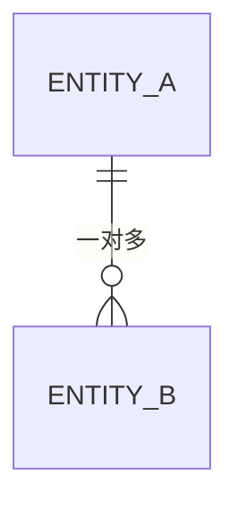

# 数据模型

> 状态：草稿
> 最后更新：<!-- TODO: YYYY-MM-DD -->
> 关联文档：[`ARCHITECTURE.md`](ARCHITECTURE.md)

存储方案定稿后填充。本文档描述**逻辑数据模型**，具体建表语句以迁移脚本为准。

---

## 1. 建模原则

- 每张表/集合必须有**单一明确职责**，名称用复数或统一约定（<!-- TODO: 确定约定 -->）。
- 必须有主键；主键不使用业务含义字段。
- 所有表包含审计字段：创建时间、更新时间（按需含创建人、更新人）。
- 删除策略明确：**物理删除**还是**软删除**（软删除需带删除标记与时间）。
- 金额使用定点数或最小货币单位整数，**禁止浮点数**。
- 时间统一存 UTC，仅在前端展示时转换时区。
- 字段尽量 `NOT NULL` + 默认值，减少空值分支。

---

## 2. 实体清单

| 实体 | 说明 | 主键 | 所属模块 |
|---|---|---|---|
| <!-- TODO --> | | | |

---

## 3. 实体关系

---

## 4. 字段定义

### 4.1 <!-- TODO: 实体名 -->

| 字段 | 类型 | 可空 | 默认值 | 说明 |
|---|---|---|---|---|
| id | | 否 | | 主键 |
| created_at | | 否 | now | 创建时间 |
| updated_at | | 否 | now | 更新时间 |

**索引**：

| 索引名 | 字段 | 类型 | 用途 |
|---|---|---|---|
| | | 唯一/普通 | |

**约束**：

-

---

## 5. 数据字典约定

| 类型 | 约定 |
|---|---|
| 主键 | <!-- TODO --> |
| 时间 | UTC，精度到秒或毫秒（统一） |
| 金额 | <!-- TODO --> |
| 状态枚举 | 用字符串而非魔法数字；取值在此登记 |
| 布尔 | 用真正的布尔类型，不用 0/1 整数 |

### 状态枚举登记

| 实体 | 字段 | 取值 | 含义 |
|---|---|---|---|
| | | | |

---

## 6. 迁移策略

- **工具**：<!-- TODO -->
- **原则**：
  - 迁移脚本**只增不改**，已执行的脚本不得修改。
  - 每个迁移必须可回滚，或明确说明为何不可回滚。
  - 大表结构变更需评估锁表时间，优先采用兼容式变更（先加后删）。
  - 生产变更前必须在预发布环境演练。
- **命名**：`时间戳_动词_对象`，例如 `20260911_create_users_table`。

---

## 7. 数据生命周期

| 数据 | 保留期 | 清理方式 | 合规要求 |
|---|---|---|---|
| | | | |

---

## 8. 变更记录

| 日期 | 变更内容 | 关联迁移 |
|---|---|---|
| | 创建文档 | |
